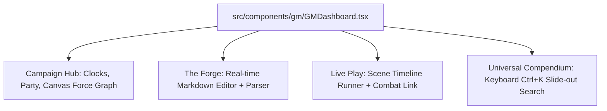

# Skyrim TTRPG GM Campaign Suite - Architectural Blueprint

This plan outlines the complete implementation of the GM Campaign Suite, bringing the full vision of a tabletop co-pilot to life. It combines a real-time markdown parser (recreating the Python `_build_web.py` pipeline), native-like local file system access, and a unified 4-pillar dashboard (Overview, The Forge editor, Live Play runner, and Compendium search).

---

## User Review Required

> [!IMPORTANT]
> **1. File System Integration (Development Phase)**
> Because browsers sandbox web pages from the local hard drive, we will use the **Web File System Access API** (Chrome/Edge/Opera). 
> - **How it works:** When entering GM Mode for the first time, you will click "Mount Campaign Folder" and select your `Frogs-5-skyrim` directory. The browser will grant the app native read/write access to that folder for the session.
> - **Files affected:** The app will directly watch/read your campaign `.md` files, read `web/registry.json`, and overwrite `web/annotations.json`, `web/web.json`, and `web/web.html`. This ensures 100% compatibility with your existing workflow, meaning you can edit in either the app or VS Code/WordPad and the data stays synchronized.
> - *Is this mount-prompt workflow acceptable for the web/dev phase before Tauri bundling?*
>
> **2. The "Preflight Checklist" & Runsheet Compilation**
> In **The Forge (Module Builder)**, you write in markdown. When you run a "Preflight Simulation", the app will:
> - Parse your markdown file into structured `SceneNode`s by dividing the document at `---` or `# Scene Title` dividers.
> - Parse paragraphs inside each scene to identify **Read Aloud** blocks (e.g. lines starting with `> Read Aloud` or `>> READ ALOUD`), **GM Notes** (lines starting with `GM:` or `* GM:`), **Checks** (bolded difficulties like `**Hard Guile (-4)**`), and **Enemies** (matching name aliases to template lists).
> - Generate a structured JSON representation of the module to feed the **Live Play** interactive timeline.
> - Run static analysis to warn you about unresolved entity candidates or missing exits.
> - *Does this markdown-to-runsheet compile schema align with how you structure your notes?*

---

## Proposed Changes

### 1. Data Models & Type Definitions
We need unified campaign structures that tie core rules to campaign narrative nodes.

#### [NEW] `src/types/campaign.ts`
```typescript
import { Stats, Equipment } from './character';
import { Combatant } from './combat';

export interface CampaignClock {
  id: string;
  name: string;
  maxSegments: number;
  currentSegments: number;
  color?: string;
}

export interface StoryBeat {
  id: string;
  title: string;
  completed: boolean;
  notes?: string;
}

export interface ExitLink {
  description: string;
  targetSceneId: string;
}

export interface SceneCheck {
  stat: 'might' | 'agility' | 'magic' | 'guile';
  difficulty: 'Easy' | 'Standard' | 'Hard' | 'Very Hard' | 'Nearly Impossible';
  penalty: number; // e.g. -4 for Hard
}

export interface SceneNode {
  id: string;
  title: string;
  subtitle?: string;
  readAloud: string[];
  gmNotes: string[];
  bullets: string[];
  findables: { name: string; description: string; resolved: boolean }[];
  npcs: { name: string; line?: string; reactions?: { action: string; response: string }[] }[];
  checks: SceneCheck[];
  enemies: string[]; // List of EnemyTemplate IDs
  exits: ExitLink[];
  combatStateSnapshot?: any; // Saved combat state if scene was left mid-fight
}

export interface CampaignModule {
  id: string;
  name: string;
  scenes: SceneNode[];
}

export interface CampaignState {
  folderMounted: boolean;
  clocks: CampaignClock[];
  storyBeats: StoryBeat[];
  activeModuleId: string | null;
  activeSceneIndex: number;
  modules: CampaignModule[];
}
```

---

### 2. Connective Tissue: File System & Live Lore Web Parser

#### [NEW] `src/utils/FileSystemManager.ts`
Handles directory mounting, reading campaign files, and writing out modified database states (`web.json`, `annotations.json`, etc.).
- Exposes `mountDirectory()` using `showDirectoryPicker()`.
- Exposes `readCampaignFile(relativePath: string): Promise<string>`.
- Exposes `writeCampaignFile(relativePath: string, content: string): Promise<void>`.
- Auto-detects campaign structure by listing markdown files recursively.

#### [NEW] `src/utils/LoreWebParser.ts`
Ports the entire Python `_build_web.py` pipeline to TypeScript, executing locally in the browser:
- **Registry & Alias Indexing**: Ingests `web/registry.json` and compiles regexes for case-sensitive (`CS_ALIASES`) and case-insensitive matching.
- **Inline Edge Harvesting**: Scans markdown text for `@web: src | type | dst | why` lines.
- **Co-occurrence Tracker**: Tracks shared file mentions and increments co-occurrence weights.
- **Candidate Generator**: Analyzes shared tags (filtering out `GENERIC` tags) and computes candidate scores: `Score = tagRarity + min(cooc, 30)`.
- **JSON & HTML Exporter**: Generates `web.json` and updates `web.html` by injecting the computed dataset back into the viewer template.

---

### 3. The 4-Pillar Dashboard Shell
We will redesign the GM dashboard to host the four campaign pillars.



#### [MODIFY] `src/components/gm/GMDashboard.tsx`
- Replace the current combat-only dashboard with a clean layout containing top tabs: **Overview (Hub)**, **The Forge (Editor)**, **Live Play (Session Runner)**, and **Archives (Compendium)**.
- Mounts and stores the Directory Handle. If not mounted, shows a sleek onboarding interface to mount the campaign folder.
- Listens globally for `Ctrl+K` to slide open the Compendium search drawer.

#### [NEW] `src/components/gm/hub/CampaignHub.tsx` (Pillar 1)
- **Active Clocks**: Displays visual progress clocks (e.g. circles divided into 4/6/8 wedges) with increment/decrement buttons.
- **Party Status**: Fetches character sheets dynamically using `characterStorage.getAllCharacters()` and lists active players, HP/FP bars, and current tiers.
- **Canvas Lore Web**: A direct TypeScript port of `web.html`'s force-directed graph renderer. Employs canvas-based drawing, simple spring physics, click-to-select, and drag-to-pin. Pinned positions are stored in `localStorage` mirroring `webpins`.

#### [NEW] `src/components/gm/builder/ModuleBuilder.tsx` (Pillar 2)
- Built-in markdown text editor for campaign files.
- **Real-time Parser Pane**: As you type, the document is parsed in the background. It displays:
  - Recognized entities and inline edges (`@web:` lines).
  - **Candidates Panel**: Shows candidate edges suggested by the engine. Click "Author Link" to inject `@web: src | type | dst | why` directly into the editor at your cursor.
  - **Secrets Matrix**: Compiles and views the secrets list.
- **Preflight Linter**: A sidebar checklist that validates:
  - If a scene has no exit nodes.
  - Unresolved entity aliases or dangling character references.
  - Validates that difficulty checks use the standard difficulty keywords.

#### [NEW] `src/components/gm/play/LivePlay.tsx` (Pillar 3)
- **Horizontal Timeline Header**: Displays the module's scenes as a chronological horizontal subway-map path. Click to jump to a scene.
- **3-Column Active Scene Dashboard**:
  - **Narrative (Col 1)**: Formatted read-aloud boxes (Georgian Serif, blue background) and GM Notes.
  - **Actors / Social (Col 2)**: Lists NPCs mentioned in the scene. Click an NPC card to slide out their description, dialogue lines, and reaction trees.
  - **Action / Loot / Enemies (Col 3)**:
    - Lists checks to make (with clickable difficulty labels explaining modifiers).
    - Lists findables/clues (clickable to reveal description).
    - Lists enemies. Click **"Deploy Encounter"** to instantly launch the combat tracker with those enemies pre-loaded.
- **Ad-hoc / Interlude scene generator**: A button at the end of the timeline to instantly insert a blank scene node if players go off-script.

#### [NEW] `src/components/gm/compendium/UniversalCompendium.tsx` (Pillar 4)
- A keyboard-friendly search drawer that slides out from the right on `Ctrl+K` or `/`.
- Fuzzy-searches across all official data arrays: spells, perks, equipment, standing stones, and custom campaign entities (locations, NPCs).
- Displays rule cheat-sheets for action economy, skill checks, and status effect lists inline without losing the user's active UI state.

---

## Verification Plan

### 1. File System Access Verification
- Open the React app locally in Chrome.
- Mount the `Frogs-5-skyrim` directory and verify it reads `registry.json` and loads entities.
- Execute a test write and confirm `web/annotations.json` updates on your hard drive.

### 2. Parser Parity Test
- Create a test script in the app that passes `campaign_status_update.md` into the TypeScript `LoreWebParser`.
- Compare the output JSON structure against the python-generated `web.json` to ensure 100% equivalence in co-occurrence calculations, aliases, and scoring metrics.

### 3. End-to-End Session Playthrough
- Build a mock adventure module in the editor with 3 scenes, a standard check, a read-aloud, and 2 enemies.
- Walk through the scenes on the timeline.
- Click "Deploy Encounter" on Scene 2, complete a round of combat in the tracker, and return to the timeline to verify the scene state remains intact.
